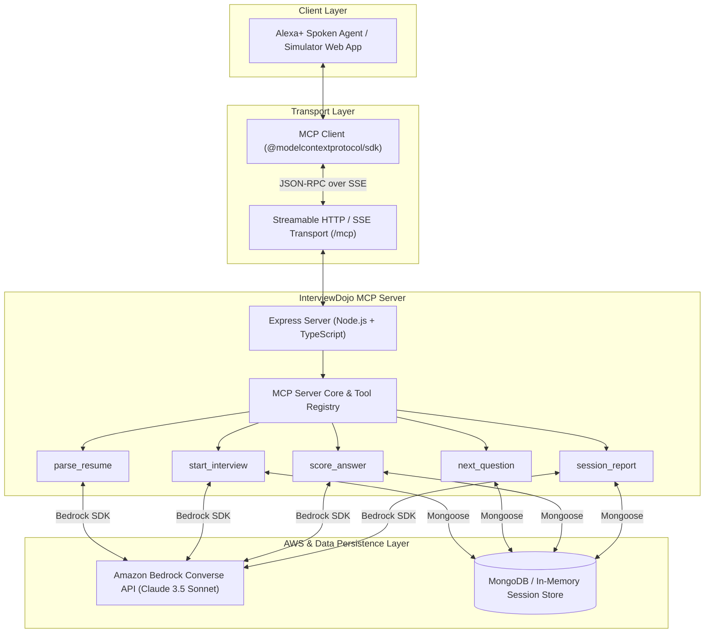

# InterviewDojo 🥋🎙️
> Self-Hosted Model Context Protocol (MCP) Server for Alexa+ Spoken Mock Technical Interviews powered by Amazon Bedrock.

**Build, Ship, Shape: Amazon Developer Hackathon (Alexa+ Track + AWS Builder Mini Challenge)**

---

## 🚀 What it is
**InterviewDojo** is a production-grade, self-hosted **Model Context Protocol (MCP)** server (MCP Spec 2025-11-25+, Streamable HTTP / SSE transport) designed to let **Alexa+** run spoken mock technical interviews for software engineering candidates.

Instead of asking generic algorithmic questions, InterviewDojo analyzes the candidate's **own resume** (projects, skills, experience) alongside a **target job description**. It generates targeted interview questions focusing ~60% on candidate projects, ~40% on skill gap areas, and exactly one STAR-method behavioral question. Answers are scored using Amazon Bar Raiser rubrics via **Amazon Bedrock Converse API**.

The project includes an **Alexa+ Voice Simulator** React web app (`/web`) that interacts directly with the server via the official `@modelcontextprotocol/sdk` client over HTTP/SSE.

---

## 📐 Architecture



---

## 📦 Registered MCP Tools

All tools validate inputs with `zod`, return structured content alongside text summaries, and handle errors cleanly:

1. **`parse_resume`** `{ resumeText: string }`
   - Extracts candidate skills, project details, work highlights, and education.
2. **`start_interview`** `{ resumeText, jobDescription, role, difficulty, numQuestions }`
   - Generates interview plan, question mix, and initializes session.
3. **`next_question`** `{ sessionId }`
   - Retrieves next question in sequence.
4. **`score_answer`** `{ sessionId, answer }`
   - Evaluates spoken/typed answer using Bedrock Bar Raiser rubric (0-10 scores for correctness, depth, clarity, spoken feedback, follow-up, ideal hint).
5. **`session_report`** `{ sessionId }`
   - Generates overall score breakdown, strengths, weak topics, and concrete 3-5 item practice plan.

---

## 🛠️ Prerequisites

- **Node.js**: v20.0.0 or higher
- **AWS Bedrock Access**: Access to `us.anthropic.claude-3-5-sonnet-20241022-v2:0` (or set `BEDROCK_MODEL_ID`) in `AWS_REGION` (`us-east-1`).
- **MongoDB** *(Optional)*: `MONGODB_URI` connection string (falls back to in-memory Map store if omitted).

---

## ⚙️ Environment Configuration

Copy `.env.example` to `.env` inside `/server`:

```bash
cp .env.example server/.env
```

```ini
PORT=3001
NODE_ENV=development
ALLOWED_ORIGIN=http://localhost:5173

# AWS Bedrock Configuration
AWS_REGION=us-east-1
BEDROCK_MODEL_ID=us.anthropic.claude-3-5-sonnet-20241022-v2:0
AWS_ACCESS_KEY_ID=your_access_key
AWS_SECRET_ACCESS_KEY=your_secret_key

# Mock LLM Flag (Set to true for test mode without AWS credentials)
MOCK_LLM=false

# MongoDB Connection String (Optional fallback to in-memory)
MONGODB_URI=mongodb://localhost:27017/interviewdojo
```

---

## 🏃 Run Commands

### 1. Install Dependencies
```bash
# Install root, server, and web app packages
npm run install:all # or cd server && npm install && cd ../web && npm install
```

### 2. Run Server & Web App Concurrently
```bash
npm run dev
```
- Express MCP Server: `http://localhost:3001/mcp`
- Health Endpoint: `http://localhost:3001/health`
- Alexa+ Simulator Web App: `http://localhost:5173`

### 3. Run Automated Seed Script (2-Minute Demo Run)
```bash
npm run seed
```

### 4. Run Vitest Unit & MCP Integration Tests
```bash
npm test
```

---

## 🔍 How to Test with MCP Inspector

You can test InterviewDojo with the official Anthropic / Model Context Protocol Inspector tool:

```bash
# 1. Start InterviewDojo server
npm run dev:server

# 2. In another terminal, run MCP Inspector pointing to the SSE endpoint
npx @modelcontextprotocol/inspector http://localhost:3001/mcp
```

Open the Inspector UI in your browser to inspect tools, input schemas, and invoke `parse_resume` or `start_interview` interactively.

---

## 🎙️ How Alexa+ Connects to `/mcp`

Alexa+ connects to InterviewDojo over the standard Streamable HTTP transport:
1. Alexa+ establishes an SSE stream by making a `GET` request to `http://<your-server-domain>/mcp`.
2. The server responds with an SSE event containing the session endpoint URL (`/mcp/messages?sessionId=...`).
3. Alexa+ sends JSON-RPC tool invocation requests (`tools/call`) via `POST /mcp/messages?sessionId=...`.
4. Spoken text responses are returned in `structuredContent` and spoken aloud by Alexa+.

---

## ⚠️ Known Limitations

1. **Browser Web Speech API Support**: Speech recognition relies on browser support (`SpeechRecognition` / `webkitSpeechRecognition`). A typed-answer fallback is provided for browsers without speech recognition support.
2. **Audio Streaming**: Audio is converted text-to-speech client-side via Web Speech API; native binary PCM streaming over SSE is reserved for future iterations.

---

## 📜 Pre-existing vs Built During the Hackathon

> *Note for Hackathon Judges & Compliance Reviewers:*

- **Pre-existing Code**: None. (Built completely fresh from scratch for this hackathon).
- **Built During Hackathon**:
  - Entire TypeScript MCP Server with Streamable HTTP transport (`/mcp`).
  - Amazon Bedrock Converse API integration with JSON validation & retry logic.
  - All 5 MCP tools (`parse_resume`, `start_interview`, `next_question`, `score_answer`, `session_report`).
  - MongoDB + in-memory fallback storage layer.
  - React + Vite + Tailwind CSS Alexa+ Voice Simulator web application (`/web`).
  - Vitest test suite and seed script.

---

## 📄 License

MIT License. See [LICENSE](LICENSE) file for details.
